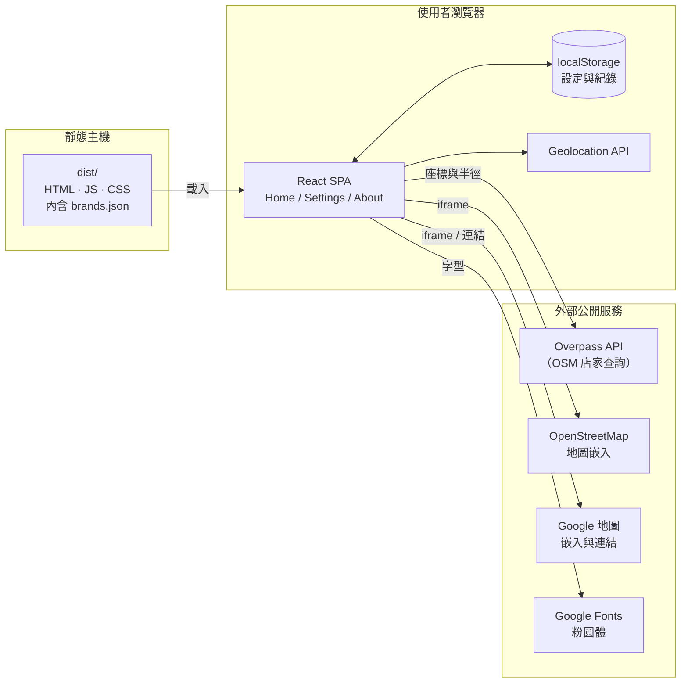
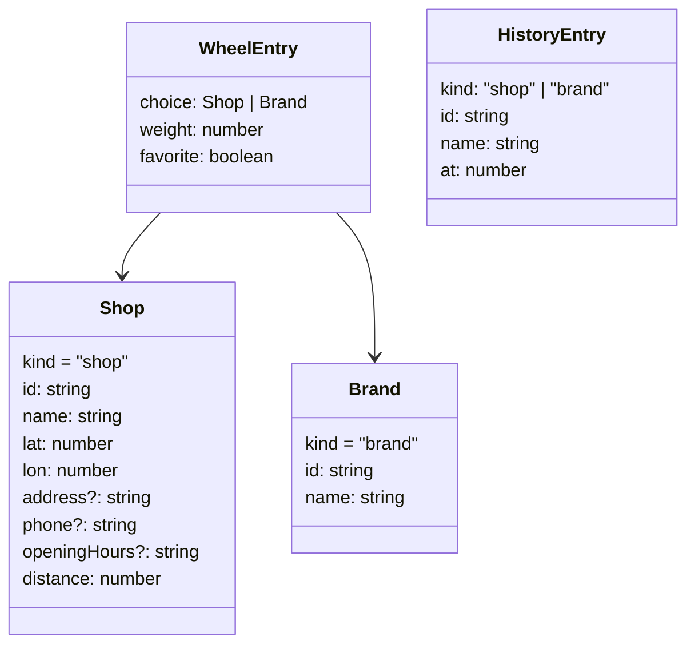
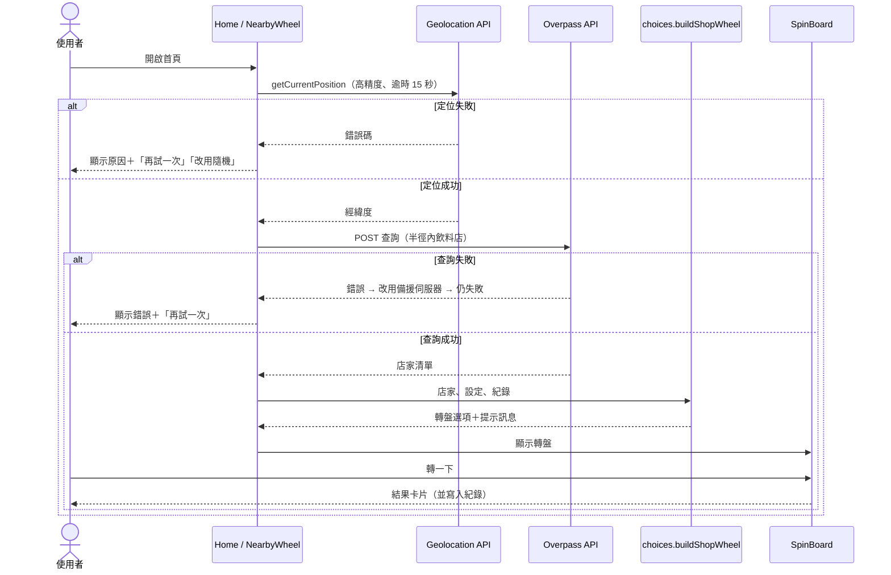
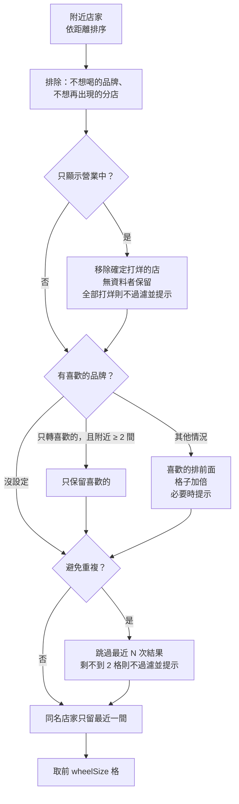

# 系統設計說明書（Software Design Document）

| 項目 | 內容 |
|---|---|
| 文件編號 | DS-SDD-001 |
| 版本 | 1.0 |
| 日期 | 2026-10-04 |
| 適用系統 | 手搖飲轉盤（drink-spinner） |
| 讀者 | 開發人員、技術主管、程式審查者 |

## 目錄

1. [目的與範圍](#1-目的與範圍)
2. [需求對照](#2-需求對照)
3. [系統架構](#3-系統架構)
4. [技術選型](#4-技術選型)
5. [目錄結構與模組職責](#5-目錄結構與模組職責)
6. [路由設計](#6-路由設計)
7. [資料模型](#7-資料模型)
8. [核心流程與演算法](#8-核心流程與演算法)
9. [外部服務介接](#9-外部服務介接)
10. [錯誤處理與降級策略](#10-錯誤處理與降級策略)
11. [隱私與資訊安全](#11-隱私與資訊安全)
12. [非功能需求](#12-非功能需求)
13. [測試策略](#13-測試策略)
14. [已知限制與後續規劃](#14-已知限制與後續規劃)

---

## 1. 目的與範圍

### 1.1 目的

本文件說明手搖飲轉盤的系統架構、模組設計、資料模型與關鍵演算法，作為開發、審查、維護與交接的依據。

### 1.2 系統概述

手搖飲轉盤是一個純前端的單頁應用程式（SPA），協助有選擇障礙的使用者決定要喝哪一家手搖飲：

- 取得使用者 GPS 位置後，以附近實際的飲料店作為轉盤選項。
- 不使用 GPS 時，從品牌清單隨機挑 6 種作為選項。
- 轉盤停止後顯示店家地圖、電話、營業時間與導航連結。

### 1.3 範圍

| 範圍內 | 範圍外 |
|---|---|
| 瀏覽器端的轉盤、設定、結果顯示 | 後端伺服器、會員系統、資料庫 |
| 透過公開 API 查詢附近店家 | 店家資料的維護與校正（由 OSM 社群負責） |
| 每月統計品牌分店數的離線腳本 | 訂單、外送、付款 |

---

## 2. 需求對照

需求來源為專案根目錄的 `開發手冊.md`。

| # | 需求 | 實作位置 | 驗證測試 |
|---|---|---|---|
| R1 | 技術：React 19+、TypeScript、Vite、React Router 7+ | `package.json` | 建置流程 |
| R2 | GPS 成功後，以鄰近飲料店作為轉盤選項 | `hooks/useNearbyShops.ts`、`lib/overpass.ts`、`lib/choices.ts` | `Home.test.tsx`「定位成功後轉附近店家」 |
| R3 | 不使用 GPS 時隨機給 6 種飲料店 | `lib/choices.ts` `pickRandomBrands` | `Home.test.tsx`「隨機 6 種品牌」、`choices.test.ts` |
| R4 | 設定功能：編輯喜愛的手搖店品牌 | `pages/Settings.tsx` | `Settings.test.tsx` |
| R5 | 轉盤結束後呈現地圖、電話等資訊 | `components/ResultCard.tsx` | `Home.test.tsx`「結果有地圖、電話、導航」 |
| R6 | 再轉一次時直接開始轉動 | `components/SpinBoard.tsx` `respin` | `Home.test.tsx`「再轉一次直接開始轉」 |

延伸功能（依需求討論新增）：排除清單、避免重複、轉盤格數、喜愛品牌加權、只顯示營業中、轉動時間、音效與震動、恢復預設值、免責聲明與常見問題頁、品牌圓章圖示。

---

## 3. 系統架構

### 3.1 架構總覽

系統沒有自有後端。所有邏輯在使用者瀏覽器執行，只向公開服務查詢地圖資料。



### 3.2 分層設計

| 層 | 目錄 | 職責 | 相依 |
|---|---|---|---|
| 頁面層 | `src/pages/` | 組合元件、處理頁面狀態與流程 | hooks、components、lib |
| 元件層 | `src/components/` | 可重用的畫面元件（轉盤、結果卡片等） | lib |
| Hook 層 | `src/hooks/` | 封裝有副作用的狀態（定位、設定、紀錄） | lib |
| 邏輯層 | `src/lib/` | 純函式：轉盤規則、角度計算、營業時間、品牌比對、API 呼叫 | data、types |
| 資料層 | `src/data/` | 品牌清單（建置時打包） | — |

設計原則：商業規則集中在 `lib/`，以純函式撰寫，不依賴 React，方便單元測試。

---

## 4. 技術選型

| 類別 | 技術 | 版本 | 選用理由 |
|---|---|---|---|
| UI 框架 | React | 19.3 | 需求指定 |
| 語言 | TypeScript | 6.0 | 需求指定；型別安全 |
| 建置工具 | Vite | 8.3 | 需求指定；開發伺服器快、設定少 |
| 路由 | React Router | 7.18 | 需求指定 |
| 樣式 | Tailwind CSS | 4.3 | 以 `@theme` 集中定義品牌色與動畫 |
| 圖示 | lucide-react | 1.51 | 輕量、可 tree-shake |
| 測試 | Vitest + jsdom + Testing Library | 5.0 | 與 Vite 共用設定；可做畫面互動測試 |
| 套件管理 | pnpm | 12.9 | 開發環境指定 |
| 地圖資料 | OpenStreetMap / Overpass API | — | 免費、開放授權、不需 API 金鑰 |

未採用的方案與原因：

| 方案 | 不採用原因 |
|---|---|
| Google Places API | 需要 API 金鑰與付費帳號，且金鑰放在前端會外洩 |
| 自建後端 | 需求不需要帳號或共享資料；無後端可降低成本與隱私風險 |
| 動畫套件（framer-motion） | 轉盤只需要 CSS transition，減少相依套件 |
| 官方品牌 logo | 商標授權風險，改用自動產生的字首圓章 |

---

## 5. 目錄結構與模組職責

```
drink-spinner/
├── index.html                 入口 HTML（字型、favicon、標題）
├── vite.config.ts             Vite 與 Vitest 設定
├── scripts/
│   └── update-brands.mjs      每月統計品牌分店數（Node 執行）
├── docs/                      本文件集
└── src/
    ├── main.tsx               建立路由並掛載 App
    ├── index.css              Tailwind 主題（色票、字型、動畫）
    ├── types.ts               共用型別
    ├── config.ts              環境變數（聯絡信箱）
    ├── data/brands.json       品牌清單（OSM 分店數前 20 名）
    ├── pages/
    │   ├── Home.tsx           首頁：GPS 模式 / 隨機模式 / 最近喝過
    │   ├── Settings.tsx       設定頁
    │   └── About.tsx          免責聲明與常見問題
    ├── components/
    │   ├── Wheel.tsx          SVG 轉盤（依權重畫格子）
    │   ├── SpinBoard.tsx      轉動控制、音效、結果卡片切換
    │   ├── ResultCard.tsx     結果卡片（地圖、電話、導航、排除）
    │   ├── HistoryList.tsx    最近喝過清單
    │   └── BrandIcon.tsx      品牌字首圓章
    ├── hooks/
    │   ├── useNearbyShops.ts  定位 + 查詢附近店家
    │   ├── useSettings.ts     設定讀寫
    │   └── useHistory.ts      紀錄讀寫
    ├── lib/
    │   ├── choices.ts         轉盤選項產生規則
    │   ├── wheel.ts           格子角度、抽籤與落點計算
    │   ├── brands.ts          品牌清單載入、驗證與比對
    │   ├── overpass.ts        Overpass API 查詢與資料轉換
    │   ├── openingHours.ts    營業時間判斷
    │   ├── storage.ts         localStorage 存取與預設值
    │   └── feedback.ts        音效（Web Audio）與震動
    └── test/                  測試輔助（setup、fixtures、render）
```

---

## 6. 路由設計

| 路徑 | 頁面 | 說明 |
|---|---|---|
| `/` | `Home` | 轉盤主畫面 |
| `/settings` | `Settings` | 設定 |
| `/about` | `About` | 免責聲明與常見問題 |

使用 `createBrowserRouter`（HTML5 history 模式）。部署時靜態主機必須把所有路徑導回 `index.html`，詳見建置與維運手冊。

---

## 7. 資料模型

### 7.1 主要型別（`src/types.ts`）



- `Choice = Shop | Brand`，以 `kind` 區分。GPS 模式產生 `Shop`，隨機模式產生 `Brand`。
- `Shop.id` 格式為 `node/123`、`way/456`（OSM 元素類型 + 編號）。
- `WheelEntry.weight` 決定格子大小與抽中機率，一般為 1，喜愛品牌加權時為 2。

### 7.2 本機儲存（localStorage）

| Key | 內容 | 上限 |
|---|---|---|
| `drink-spinner:settings` | `AppSettings` JSON | — |
| `drink-spinner:history` | `HistoryEntry[]` JSON，新的在前 | 30 筆（畫面顯示最近 10 筆） |

### 7.3 設定項目（`AppSettings`）

| 欄位 | 型別 | 預設值 | 選項 | 說明 |
|---|---|---|---|---|
| `useGps` | boolean | `true` | — | 是否使用 GPS 模式 |
| `favoriteBrands` | string[] | `[]` | — | 喜歡的品牌名稱 |
| `favoriteMode` | `'filter' \| 'weight'` | `'filter'` | — | 只轉喜歡的／喜歡的格子加倍 |
| `excludedBrands` | string[] | `[]` | — | 不想喝的品牌 |
| `excludedShops` | `{id, name}[]` | `[]` | — | 不想再出現的分店 |
| `radius` | number（公尺） | `1000` | 500、1000、2000、3000 | 搜尋範圍 |
| `wheelSize` | number | `12` | 6、8、12 | GPS 模式最多幾格 |
| `avoidRepeat` | number | `0` | 0、1、3、5 | 跳過最近 N 次結果，0 為關閉 |
| `onlyOpen` | boolean | `false` | — | 只顯示營業中的店 |
| `spinSeconds` | number（秒） | `4` | 2.5、4、6 | 轉動時間 |
| `sound` | boolean | `true` | — | 音效 |
| `vibration` | boolean | `true` | — | 震動 |

### 7.4 相容性與資料移轉

- 讀取設定時以 `DEFAULT_SETTINGS` 補齊缺少的欄位，舊版設定可直接沿用。
- 品牌名稱經 `normalizeBrandNames` 轉換為目前品牌清單的名稱並去重，例如「麻古」→「麻古茶坊」、「清心」→「清心福全」。不在清單中的名稱保留為自訂品牌。
- JSON 解析失敗或 localStorage 無法使用（如無痕模式）時，改用預設值，不會中斷頁面。

### 7.5 品牌清單（`src/data/brands.json`）

| 欄位 | 說明 |
|---|---|
| `source`、`sourceUrl`、`license` | 資料來源與授權標示 |
| `rankLabel` | 排名依據，顯示為「全台分店數第 N 名」 |
| `period`、`updatedAt` | 資料日期 |
| `brands[]` | `rank`、`name`（顯示用短名）、`fullName`、`keywords`（比對用）、`stores`（分店數） |

驗證規則（`parseCatalog`）：`brands` 至少 6 筆，且每筆有數字 `rank`、非空 `name`、字串 `fullName`、非空的 `keywords` 陣列。不符合或檔案不存在時，退回程式內建的 12 個品牌（`FALLBACK_CATALOG`）。

---

## 8. 核心流程與演算法

### 8.1 GPS 模式流程



`useNearbyShops` 的 effect 依賴 `radius`、喜愛品牌與重試次數。元件卸載或條件改變時以 `AbortController` 取消進行中的請求，避免過期資料覆蓋畫面。

### 8.2 轉盤選項產生規則（GPS 模式，`buildShopWheel`）

輸入的店家已依距離由近到遠排序，依序套用：



規則補充：

- **同一間店的判定**：OSM 上同一間店可能登錄成多筆（同名不同 id），因此排除與避免重複都以「id 或店名相同」判定。
- **只轉喜歡的但附近只有 1 間**：單格轉盤沒有意義，改為混入其他店，喜歡的格子加倍。
- **提示訊息**：每次退回或放寬條件都會回傳 `notes`，顯示在轉盤上方，讓使用者知道原因。

### 8.3 隨機模式（`pickRandomBrands`、`buildBrandWheel`）

1. 候選品牌 = 喜歡的品牌 ＋ 品牌清單，扣除不想喝的品牌。
2. 開啟避免重複時，若扣除最近喝過的品牌後仍有 6 個以上候選，就扣除。
3. 喜歡的品牌優先入選，不足 6 個再從品牌清單隨機補足，最後打亂順序。
4. 轉盤顯示時再即時套用排除與避免重複，因此結果卡片按「不想喝這個品牌」後會立即從轉盤移除。

「換一批」會重新抽選，並以品牌組合作為 `SpinBoard` 的 `key` 重新掛載，清除上一輪結果。

### 8.4 轉動與落點演算法（`lib/wheel.ts`）

**格子角度**：格子從正上方 0 度開始順時針排列，每格角度 = 權重 ÷ 總權重 × 360°。

**抽籤與目標角度**（`planSpin`）：

1. 依權重抽出結果格 `index`（權重 2 的格子機率為兩倍）。
2. 在該格角度範圍的 15%～85% 之間隨機取目標點，避免停在格線上。
3. 計算新的旋轉角度，讓目標點轉到正上方的指針：

```
delta    = (360 − target − rotation mod 360) mod 360
rotation = rotation + 360 × turns + delta
turns    = round(轉動秒數 × 1.5)    // 2.5 秒 → 4 圈、4 秒 → 6 圈、6 秒 → 9 圈
```

**結果先決定、動畫後呈現**：結果在開始轉動時就已抽出，動畫只是呈現。測試以 5,000 次連續轉動驗證指針一定停在抽中的格子。

**動畫與結束判定**（`SpinBoard`）：

- 以 CSS `transition: transform`（`cubic-bezier(0.17, 0.67, 0.12, 0.99)`）旋轉 SVG。
- `transitionend` 事件觸發時顯示結果；另設「轉動時間 + 400ms」的保險計時器，避免切換分頁等情況事件沒觸發。兩者以 `spinningRef` 防止重複執行。
- 轉動中與顯示結果時，轉盤內容被凍結（`frozen`），避免紀錄更新造成格子跳動；下一次轉動時才換成最新選項。
- **再轉一次**：捲動回轉盤並直接呼叫 `spin()`，不需再按「轉一下」。

**音效**：轉動中以 `requestAnimationFrame` 讀取 SVG 實際的 transform 矩陣，算出指針所在格，換格時播放「喀」聲；停止時播放三音「叮咚」。聲音以 Web Audio API 即時合成，不需音檔，並在使用者點擊時解鎖 AudioContext。

### 8.5 營業時間判斷（`lib/openingHours.ts`）

解析 OSM `opening_hours` 的常見寫法，回傳 `true`（營業中）、`false`（休息中）或 `null`（無法判斷）。

| 支援寫法 | 範例 |
|---|---|
| 全天 | `24/7` |
| 每天同時段 | `10:00-22:00` |
| 星期區間與列舉 | `Mo-Fr 09:00-21:00; Sa,Su 10:00-22:00` |
| 跨週區間 | `Fr-Mo 11:00-20:00` |
| 公休 | `Mo off` |
| 一天多時段 | `11:00-14:00,17:00-21:00` |
| 跨夜 | `18:00-02:00`（凌晨時段會參考前一天） |

規則：後面的規則覆蓋前面的；規則沒提到的星期視為公休；`PH`（國定假日）規則略過；不支援的語法（如 `10:00+`、`sunrise-sunset`）回傳 `null`，視為「不確定」而非打烊。

### 8.6 品牌比對（`lib/brands.ts`）

| 函式 | 用途 |
|---|---|
| `findBrand(name)` | 以名稱、完整名稱或關鍵字（完全相符）找出品牌 |
| `brandOfShop(shopName)` | 店名包含哪個品牌的關鍵字（用於圖示、排名顯示） |
| `brandKeywords(name)` | 品牌的所有關鍵字；自訂品牌回傳名稱本身 |
| `normalizeBrandNames(names)` | 舊名稱轉成目前清單名稱並去重 |

比對一律不分大小寫。測試確保同一個關鍵字只屬於一個品牌，避免誤判。

### 8.7 品牌分店數統計（`scripts/update-brands.mjs`）

1. 以 Overpass 查詢全台 `shop=beverages` 及 `cuisine` 含 `bubble_tea`／`tea`／`juice` 的店家。
2. 有 `brand` 標籤者依標籤歸類（透過別名表 `ALIASES` 統一寫法）；沒有標籤者以店名比對別名表的關鍵字。
3. 排除少於 3 間的品牌，取前 20 名寫入 `brands.json`，保留原檔中同品牌的關鍵字。
4. 伺服器忙碌（429、502、503、504）時最多重試 3 次，間隔 30、60 秒。
5. `--save <檔案>` 保存 Overpass 原始結果；`--input <檔案>` 用已保存的資料離線重算。

---

## 9. 外部服務介接

| 服務 | 用途 | 呼叫方式 | 傳送的資料 | 失敗處理 |
|---|---|---|---|---|
| Overpass API（`overpass-api.de`，備援 `overpass.kumi.systems`） | 查詢附近飲料店 | `POST`，`data=` Overpass QL，伺服器端逾時 25 秒 | 使用者座標、搜尋半徑、品牌關鍵字 | 換備援伺服器；仍失敗則顯示錯誤與重試按鈕 |
| OpenStreetMap 嵌入地圖 | GPS 模式結果卡片地圖 | `iframe`，店家座標 ±0.004 度範圍 | 店家座標 | 地圖空白不影響其他資訊 |
| Google 地圖 | 隨機模式地圖、地址查詢、導航 | `iframe`（`output=embed`）與外部連結 | 品牌或店名、店家座標 | 無 API 金鑰的嵌入屬舊功能，可能無法顯示；連結不受影響 |
| Google Fonts | 粉圓體字型 | `<link>` 樣式表 | 一般連線資訊 | 退回系統字型 |

Overpass 查詢條件（附近店家）：

```
nwr["shop"="beverages"](around:半徑,緯度,經度);
nwr["cuisine"~"(^|;)(bubble_tea|tea|juice)(;|$)"](around:...);
nwr["amenity"~"^(cafe|fast_food)$"]["name"~"關鍵字",i](around:...);
nwr["brand"~"關鍵字",i](around:...);
out center tags;
```

關鍵字包含一般飲料字詞（茶、飲、奶、珍珠、果汁、tea）、品牌清單所有關鍵字，以及使用者喜愛品牌的關鍵字，並經正規表示式跳脫處理。`cuisine` 條件有前後界定，避免「steak」被當成「tea」。

---

## 10. 錯誤處理與降級策略

| 情境 | 系統行為 |
|---|---|
| 瀏覽器不支援定位 | 顯示提示，提供改用隨機模式 |
| 使用者拒絕定位、定位逾時、無法取得位置 | 依錯誤碼顯示對應訊息，提供「再試一次」與「改用隨機」 |
| Overpass 主伺服器失敗 | 自動改用備援伺服器 |
| 所有 Overpass 伺服器失敗 | 顯示錯誤與「再試一次」 |
| 附近沒有店 | 提示擴大搜尋範圍或改用隨機 |
| 篩選後選項太少 | 依 8.2 節規則放寬條件並顯示提示 |
| 隨機模式品牌全被排除 | 提示到設定頁調整 |
| `brands.json` 遺失或格式錯誤 | 使用內建品牌清單，開發模式於主控台警告 |
| localStorage 無法讀寫 | 使用預設值，寫入失敗時忽略 |
| `transitionend` 未觸發 | 保險計時器在轉動時間 + 400ms 後結束轉動 |
| 裝置不支援震動 | 設定頁停用震動開關並說明 |

---

## 11. 隱私與資訊安全

### 11.1 個人資料

- 本站沒有後端與資料庫，不收集、不保存任何個人資料。
- 設定與紀錄只存在使用者瀏覽器的 localStorage，使用者可在設定頁清除。
- GPS 座標只在瀏覽器中使用，查詢時傳送給 Overpass API。本站不記錄座標，但第三方服務會依其隱私權政策處理連線資料（例如 IP 位址），此事已在「免責聲明與常見問題」頁揭露。

### 11.2 安全設計

- 不使用任何 API 金鑰，前端沒有可外洩的秘密。
- 使用者輸入（自訂品牌）只存在本機，並以 React 文字節點輸出，不使用 `innerHTML`。
- 送往 Overpass 的關鍵字經正規表示式與引號跳脫。
- 外部連結皆加上 `rel="noreferrer"`。
- 建議部署時設定 Content Security Policy，白名單見建置與維運手冊。

### 11.3 智慧財產

- 店家資料：OpenStreetMap，ODbL 授權，頁面標示「© OpenStreetMap contributors」。
- 品牌清單：自行統計 OSM 分店數，不引用第三方排行。
- 品牌圖示：自動產生的字首圓章，不使用官方 logo。
- 免責聲明頁提供權利人聯絡與移除申請管道（信箱由 `VITE_CONTACT_EMAIL` 設定）。

---

## 12. 非功能需求

| 項目 | 設計 |
|---|---|
| 效能 | 正式建置 JS 約 361 KB（gzip 116 KB）、CSS 約 26 KB；轉盤動畫使用 GPU 加速的 CSS transform |
| 響應式 | 以手機為主要版面，最大寬度 36rem，桌機置中 |
| 無障礙 | 轉盤 SVG 提供 `role="img"` 與包含所有選項的 `aria-label`；分段選項使用 `radiogroup`；開關以原生 checkbox 實作；圖示按鈕有 `aria-label` |
| 減少動態效果 | 系統偏好「減少動態效果」時停用裝飾動畫 |
| 瀏覽器相容 | 需支援 ES2023、CSS transform、Geolocation API；GPS 需在 HTTPS 或 localhost 下執行 |
| 可維護性 | 商業規則集中於 `lib/` 純函式；型別檢查、ESLint、自動化測試 |

---

## 13. 測試策略

| 層級 | 工具 | 範圍 |
|---|---|---|
| 靜態檢查 | TypeScript（`tsc -b`）、ESLint（含 React Hooks 規則） | 全部原始碼 |
| 單元測試 | Vitest | `lib/` 所有模組 |
| 畫面測試 | Vitest + jsdom + Testing Library | 首頁、設定頁、免責聲明頁的使用者操作流程 |

測試檔案與重點（共 9 個檔案、85 個測試案例）：

| 檔案 | 重點 |
|---|---|
| `lib/openingHours.test.ts` | 17 種營業時間寫法與時間點 |
| `lib/wheel.test.ts` | 角度分配；5,000 次轉動落點正確；加權機率約兩倍；不停在格線 |
| `lib/choices.test.ts` | 排除、營業中、喜愛品牌兩種模式、避免重複、同名重複登錄、隨機 6 種 |
| `lib/brands.test.ts` | 清單格式、名次與店數遞減、關鍵字唯一、比對與舊名稱轉換、格式錯誤退回 |
| `lib/storage.test.ts` | 預設值、損壞資料、舊版設定移轉、紀錄上限 |
| `lib/overpass.test.ts` | 資料轉換與排序、查詢內容、備援伺服器、全部失敗 |
| `pages/Home.test.tsx` | 隨機模式完整流程、再轉一次直接轉、換一批、排除、保險計時器、GPS 成功／拒絕／失敗重試／無店家 |
| `pages/Settings.test.tsx` | 模式切換、最愛、自訂品牌、排除、恢復預設需確認、清除紀錄 |
| `pages/About.test.tsx` | 各區塊存在、無第三方排行引用、聯絡信箱有無設定 |

自動化測試無法涵蓋的項目（需人工驗證）：實際視覺、轉盤動畫流暢度、音效、手機震動、真實定位與真實 Overpass 回應。

---

## 14. 已知限制與後續規劃

### 14.1 已知限制

| 限制 | 影響 | 因應 |
|---|---|---|
| OSM 店家資料不完整 | 部分店家不會出現；電話、營業時間常缺 | 結果卡片提供 Google 地圖查詢連結 |
| 營業時間只支援常見寫法 | 特殊寫法顯示為「不確定」 | 「只顯示營業中」保留不確定的店 |
| Overpass 為公益服務 | 尖峰時段可能忙碌或限流 | 備援伺服器與重試按鈕 |
| 分店數不等於人氣 | 品牌排行只反映店數 | 介面與免責聲明已註明 |
| iOS Safari 不支援震動 | iPhone 無震動回饋 | 設定頁自動停用並說明 |

### 14.2 後續規劃建議

- 手動設定位置或常用地點（公司、家）。
- 自動化每月品牌更新（排程執行腳本並建立合併請求，人工審查後合併）。
- 端對端測試（Playwright）涵蓋實際瀏覽器的動畫與定位流程。
- PWA 支援（加入主畫面、離線顯示上次結果）。
